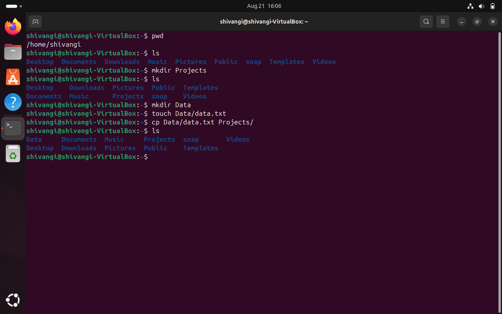

### Aim: To learn and perform basic file and directory operations in Linux using different commands.

### Commands used: 

`pwd` - shows present working directory.
`ls` - lists files and folders.
`mkdir` - creates a new directory.
`touch` - creates a new empty file.
`cp` - copies a file to another directory.

### Procedure

1. Display the current directory using pwd.

2. List available directories using ls.

3. Create a new folder Data using mkdir Data.

4. Inside Data, create a new file data.txt using touch Data/data.txt.

5. Copy the file into another folder projects using cp Data/data.txt projects/.

6. Verify the copied file with ls.
  
  ### Snapshot:
  
