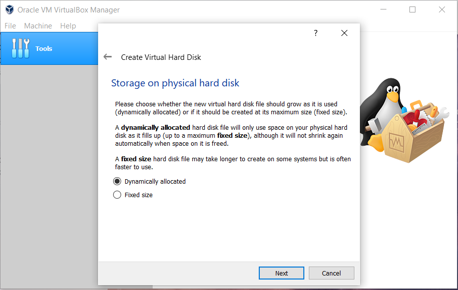

# Assignment - 1
# Installation of Ubuntu In Virtual Machine


Ubuntu is a free, open-source Linux OS known for its simplicity and security. We’re installing it using VirtualBox, a tool that lets us run Ubuntu safely inside our current system without making permanent changes. This setup is ideal for learning, testing, or development.

````bash
⚡ VirtualBox Quick Hits
````

Popular Tool – Made by Oracle, widely used for virtualization.

*  Fast Performance – Supports Intel VT-x & AMD-V for speed.

*  Multi-VM Support – Run many OSes on one machine.

*  Async Disk I/O – Efficient data handling.

*  Seamless Windows – Guest OS windows blend with host.

Note: For the installation of VirtualBox on Windows, download the installer from Oracle’s official site [ Virtual Box](https://www.virtualbox.org/wiki/Downloads) and download the latest version for Windows.

## 🚀 Installation Guide for Virtual Box :

### 1️⃣ Download VirtualBox

*  Visit the official VirtualBox website.

*  Click on “Download VirtualBox”.

*  Choose Windows hosts to get the installer for Windows.


### 2️⃣ Run the Installer

*  Find the downloaded .exe file (usually in your Downloads folder).

*  Double-click to launch the installer.

*  Click Yes if Windows asks for permission. 


### 3️⃣ Choose Installation Location

*  You’ll be asked where to install VirtualBox.

*  The default location is fine—click Next unless you want to change the location.


### 4️⃣ Select Features and Shortcuts

*  Choose which components to install (USB support, networking, etc.)

*  Leave everything checked unless you know you don’t need something.

*  Optionally, add a desktop shortcut.

*  Click on the "Next" option.


 ### 5️⃣ Network Warning

* A warning might pop up saying your network will reset briefly

* This is normal—click Yes to proceed


### 6️⃣ Begin Installation

* Review your settings

* Click Install to start the process

.png>)

### 7️⃣ Installation Progress

* Wait while the software installs

* If prompted to install drivers, click Install


### 8️⃣ Finish Setup

* Once installation is complete, click Finish

* VirtualBox will open automatically (unless you uncheck that option)


### 🖥️ After Installation

* You’ll see the VirtualBox interface

* From here, you can start creating virtual machines and install other operating systems.


## 🐧 Installing Ubuntu on VirtualBox

Now that VirtualBox is installed, let’s move on to setting up Ubuntu inside it. This will let you run Ubuntu as a virtual machine without affecting your main Windows system.

```bash 

🔧 Ubuntu Installation Steps
```
### 1️⃣ Grab the Ubuntu ISO
Head over to the official [Ubuntu](https://ubuntu.com/download) site and download the latest Desktop version (LTS is safest). It’s basically the operating system file you’ll “insert” into your virtual machine.

### 2️⃣ Create a New Virtual Machine

* Open VirtualBox → Click New.


* Name: Ubuntu.

* Type: Linux.

* Version: Ubuntu (64-bit) Click Next.


### 3️⃣ Assign RAM

* Pick how much memory to give your VM.

* Recommended: 4096 MB (or more if your system can handle it) Click Next.

.png>)

### 4️⃣ Set Up Virtual Hard Disk

* Choose “Create a virtual hard disk now” → Click Create.


* Format: VDI.


* Storage: Dynamically allocated.



* Size: At least 10-20 GB. Click Create.


### 5️⃣ Mount the Ubuntu ISO

* Go to Settings for your VM → Storage

* Click the empty disk icon 


* On the right, click the disk symbol → Choose your downloaded Ubuntu ISO Click OK


### 6️⃣ Start the VM

* Click Start Ubuntu will boot from the ISO and launch the installer

### 7️⃣ Install Ubuntu

* Follow the on-screen steps:

* Choose language and keyboard layout


* Select “Normal Installation”


* Click Continue

### 8️⃣ Disk Setup

* Click Install Now Confirm changes (don’t worry—it only affects the virtual disk) Click Continue

### 9️⃣ User Info

* Fill in your name, username, password, etc. Click Continue Let Ubuntu do its thing—it’ll take a few minutes.


### 🔟 Final Touch

* Once it’s done. Click Restart.


* Now Your virtual Ubuntu system is ready to explore.


```bash
 With the installation of Ubuntu on VirtualBox, the main objective of this assignment has been successfully achieved. The process helped me understand virtualization and how operating systems can be managed in a virtual environment.
```


Extra Questions
1.What are two advantages of installing Ubuntu in VirtualBox?

ans:
* No Need to Modify Your Main System VirtualBox allows you to run Ubuntu inside your existing OS (like Windows or macOS), so you don’t need to partition your hard drive or risk messing up your current setup. It’s perfect for testing or learning without commitment.
* Run Multiple OSes Simultaneously You can use Ubuntu and your host OS at the same time.

2.What are two advantages of dual booting instead of using a VM?

ans:
* Full Hardware Performance Dual booting gives Ubuntu direct access to your system’s hardware
*  Greater Stability for Long Sessions Since only one OS runs at a time, there’s no resource sharing or virtualization overhead.

<h2 align="center">Thank you</h2>


