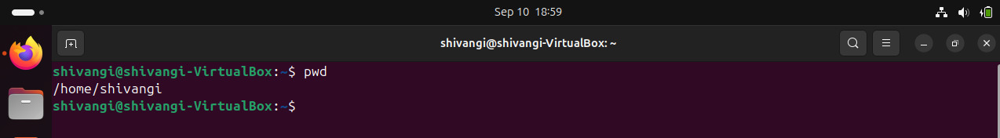
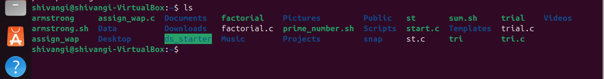
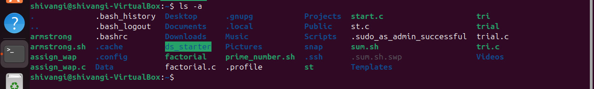

# Assignment 1 - Linux Basics

1. `pwd`  This command shows you exactly where you are in your system. Like, if you’re lost in folders, just type pwd and it’ll tell you the full path of your current location. 

2. `ls` Want to see what’s inside a folder? Use ls. It lists all the files and folders sitting there.

3. `ls -a` This one’s like ls, but with extra powers—it also shows hidden stuff, like files that start with a dot (.).

4. `ls -la` This gives you the full details—permissions, owners, sizes, and dates—for every file, even the hidden ones.

5. `ls -l` in Linux is used to list files and directories in the current location with detailed information.

6. `cd` foldername Use this to jump into a folder. Like if you want to go into the “Scripts” folder, just type cd Scripts.

7. `cd ..` This takes you one step back. If you’re deep inside a folder and want to go up, this is your exit.

8. `mkdir` foldername Want to make a new folder? This command creates one. For example, mkdir Repo makes a folder named “Repo”.

9. `touch filename.txt` This creates a new empty file. Like touch repo_1.txt makes a blank file called “repo_1.txt”.

10. cp file1 file2 Copies one file to another. So cp notes.txt backup.txt makes a copy of “notes.txt” named “backup.txt”.

11. `mv oldname newname` Use this to rename a file or move it somewhere else. Like mv notes.txt NOTES.txt changes the name.

12. `rm` filename Deletes a file permanently. Be careful—once it’s gone, it’s gone.

13. `nano` nano repo1.txt This opens a simple text editor in the terminal. You can write or edit stuff directly in the file.

 
14. `cat` cat repo1 Shows you what’s inside a file. It just prints the content in the terminal.

15. `echo` "text" Prints whatever you write in quotes. Like echo "Hello" will show “Hello” on the screen.

16. `whoami` Tells you which user is currently logged in. Handy when you’re working on shared systems.

17. `man ls` command Opens the manual for any command. Like man ls gives you all the info about how ls works.

18. grep "text" filename Searches for a specific word or phrase inside a file. Like grep "Hello" repo1.txt looks for “Hello” in that file.

19. `chmod` This changes who can read, write, or run a file. For example, 
     * chmod u+x file.sh lets the owner run the file.
       file - repo1.txt

    

     chmod 777 repo2.txt: Any user can read, modify and execute.

     
 

Extra Questions

Q1. What is the difference between chmod and chown?

 Ans. chmod:-This command modifies the permissions of a file or directory.-Permissions define what actions such as read, write or execute can be performed by
 different entities (owner, group, others).
 chown:-This command modifies the ownership of a file or directory.-It changes which user and/or group is associated with the file or directory.

 
 Q2. How do you check current directory and user?

 Ans. To check the current directory, we use the command pwd. It displays the full and
 absolute path of the current working directory.
 To check the current user, we use the command whoami. It displays the username of the
 current effective user.

 <h2 align="center">Thank you☺️</h2>