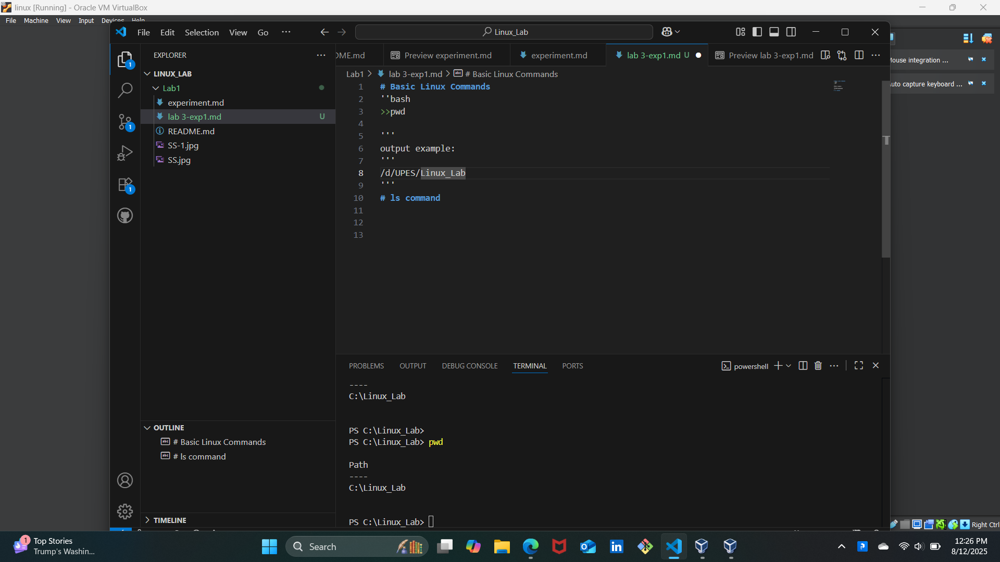
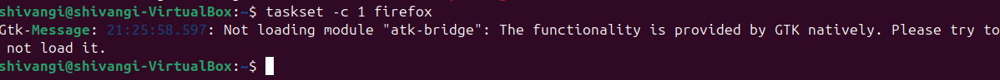

 # Process Management in linux 

## 1️⃣ ps aux


Explanation:
```bash
 a → show processes for all users.

 u → show user/owner of process.

 x → show processes not attached to a terminal.
```

### 📷 Output Snapshot:


## 2️⃣ Process Tree 🌳

### Command: 

```bash
pstree -p
```
➡️ Shows parent- child relationships.


### 📷 Output Snapshot:


## 3️⃣ Real-Time Monitoring

### Command: 

```bash 
top 
``` 
 ➡️ Press q to quit.

### 📷 Output Snapshot: 


 

##  4️⃣ Adjust Process Priority


 ♦️ Start a process with low priority:

```bash 
  nice -n 10 sleep 300 &
  ``` 

 ➡️ PID = `3248` is running in background with nice value 10.

  ### 📷 Output Snapshot:


♦️ Change priority of running process: 

```bash
renice -n -5 -p 3248
```
➡️ Now process runs with higher priority.

### 📷 Output Snapshot:


## 5️⃣ CPU Affinity (Bind Process to CPU Core)

### Command:

```bash
 taskset -cp 3369
``` 

### 📷 Output Snapshot:


* pid 3369's current affinity list: 0-3

* Shows process is allowed on cores `0,1,2,3`.

♦️ Restrict to core 1 only: 

```bash
taskset -cp 1 3369
``` 

### 📷 Output Snapshot:


## 6️⃣ I/O Scheduling Priority

### Command: 

```bash
ionice -c 3 -p 3369
``` 

### 📷 Output Snapshot:


➡️ Class 3 (idle) → Process only gets I/O when system is idle.


## 7️⃣ File Descriptors Used by a Process

### Command:

```bash
 lsof -p 3477 | head -5 
``` 

### 📷 Output Snapshot:


## 8️⃣  Trace System Calls of a Process

### Command: 

```bash
strace -p 3477
```

### 📷 Output Snapshot:


➡️ Great for debugging.


## 9️⃣ Find Process Using a Port

### Command:

```bash
sudo fuser -n tcp 8080
``` 

### Output Snapshot:

---


 ➡️ PID is using port 8080.

## 🔟 Per-Process Statistics

### Command:

```bash
 pidstat -p 3636 2 3
 ```

### 📷 Output Snpashot:


- Shows CPU usage every 2 seconds, 3 times.


## ⏸️ Control Groups (cgroups) for Resource Limits

Create a new cgroup:
```bash
sudo cgcreate -g cpu,memory:/testgroup
``` 

🔸This will create a new cgroup named /testgroup under both the cpu and memory subsystems.
🔸To execute the above, you need to download cgroup tools.

Limit CPU and Memory:
```bash
echo 50000 | sudo tee /sys/fs/cgroup/cpu/testgroup/cpu.cfs_quota_usecho 100M  | sudo tee /sys/fs/cgroup/memory/testgroup/memory.limit_in_bytes
```
🔸Here the processes in testgroup can use at most 50% of one CPU core.
🔸Add a process (PID 3050) to cgroup:

```bash
echo 3050 | sudo tee /sys/fs/cgroup/cpu/testgroup/cgroup.procs
```
🔸Here the cgroup is limited to 100 MB of RAM.
🔸Basically the processes in cgroup cannot use more than 100 MB of memory.

## 1️⃣2️⃣ Alternatives to nice/renice

### 1. chrt (Real-Time Schedulig)
🔸Set real-time scheduling policies (FIFO or Round Robbin).

The commands:
sudo chrt -f 50 sleep 1000
🔸It will give no output. It runs sleep for 1000 seconds.
🔸Your terminal will wait for sleep to finish.
```bash
chrt -p <pid>
```
🔸This command displays the current scheduling policy and priority of a running process.
### 📸Image Snapshot:



### 2. ionice (I/O Priority Control)
The command:
```bash 
ionice -c 2 -n 7 tar -czf backup.tar.gz /home
``` 
🔸It runs the tar command (which mankes a compressed backup of /home), but with low disk I/O priority.

### 📸Image Snapshot:


### 3. taskset (CPU Affinity)
The command:
```bash
taskset -c 1 firefox
```
🔸Firefox will only execute on CPU core 1, never switching to other cores.
🔸If the command was successfull it will not give any output.
🔸If it shows any informational warning about not loading the atk-bridge module because its functionality is already provided by GTK.

### 📸Image Snapshot:




### 4. Control Groups (cgroups)
The command:
```bash
sudo cgcreate -g cpu,memory:/lowprio
echo 20000 | sudo tee /sys/fs/cgroup/cpu/lowprio/cpu.cfs_quota_us
echo 200M | sudo tee /sys/fs/cgroup/memory/lowprio/memory.limit_in_bytes
echo 1234 | sudo tee /sys/fs/cgroup/cpu/lowprio/cgroup.procs
``` 

🔸This creates a control group (cgroup) called lowprio and applies CPU and memory limits to it.

⚠️This is safe only if the pid being used is a test or non-critical process.

⚠️If it is a PID given by the system, it may slow down or even crash under resource pressure. Better to avoid running it.

### 5 systemd-run

The command:
```bash
systemd-run --scope -p CPUweight=200 stress --cpu 4
```

🔸Runs a command under a transient systemd scope with specific resource weights.

⚠️The stress tool will consume CPU resources while running. It is safe for testing but will slow other tasks temporarily.

🟡Better to avoid running it.

### 6. schedtool
The command:
```bash
sudo schedtool -R -p 10 <pid>
```
🔸Changes the CPU scheduling policy and priority of a running process.

⚠️Real time scheduling can be dangerous if applied to the wrong process.
 It can monopolize CPU time and make your system unresponsive.

⚠️Always keep a terminal open to revert it or reboot if the system locks up.

🟡Better to avoid running it.

## Summary Table

## Summary Table
| Tool | Focus | Alternative to |
| :--: | :---: | :----: |
| chrt | Real time scheduling policies| nice |
| ionice | I/O priority control | (complementary) |
| taskset | CPU affinity control | (complementary) |
| cgroups | File-grained resource management | nice (more powerful) |
| systemd-run | systemd+cgroups resource management | nice |
| schedtool | Custom scheduling policies | nice |


<h2 align="center">Thank you☺️</h2>