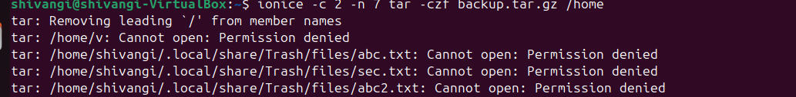

Experiment:

This experiment consists of snapshots in which we have firstly created a parent folder.

Then in a parent folder we created a child folder.
After that we made a text file in the child folder and copied that file from child to parent folder. 
The commands for performing the experiment are as follows:

