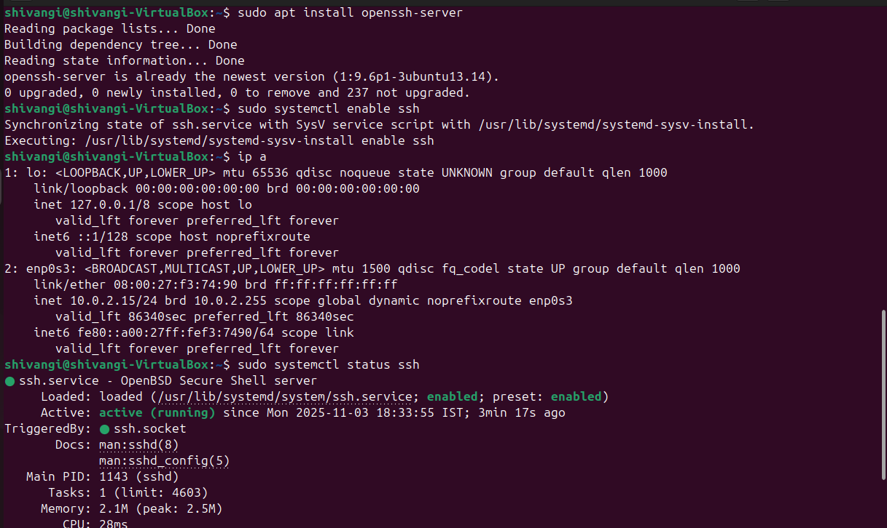

# 🧪 Experiment 1: Transfer a File Using SSH While on the Same Network

---

## 🎯 Objective

To transfer a file from one Linux machine (Sender) to another (Receiver) using SSH and the `scp` command, while both machines are connected to the same local network.

---

## 🛠️ Requirements

- Two Ubuntu machines connected to the same Wi-Fi or LAN
- SSH installed and running on both machines
- A sample file (e.g., `test.txt`) on the Sender machine

---

## 🖥️ Role A: Receiver Machine (Machine that will receive the file)

### Step 1: Install and Start SSH
```bash
sudo apt update
sudo apt install openssh-server
sudo systemctl enable ssh
sudo systemctl start ssh
```


• This sets up the SSH server so the machine can accept incoming connections.

### Step 2: Find IP Address
```bash
ip a
```

- Look for the IP address under your active interface (e.g., 192.168.x.y)
- Share this IP with the Sender machine

### Step 3: Confirm SSH is Running
```bash
sudo systemctl status ssh
```



- Make sure it shows active (running)

## 🖥️ Role 2: Sender Machine (Machine that will send the file)

### Step 1: Install and Start SSH (same as Receiver)
```bash
sudo apt update
sudo apt install openssh-server
sudo systemctl enable ssh
sudo systemctl start ssh
```
- This ensures the sender can use SSH and SCP commands

### Step 2: Test SSH Connection to Receiver
```bash
ssh username@ip_address
```
- Replace username with the actual user on the Receiver machine
- If prompted, enter the Receiver’s password.

### Step 3: Create a Sample File
```bash
echo "This is a test file." > test.txt
```
- This creates a file named test.txt with sample content.

### Step 4: Send the File Using SCP
```bash
scp test.txt username@ip_address_reciever:/home/username/
```

- test.txt: the file to send.
- username: user on the Receiver machine.
- /home/username/: destination folder on the Receiver.

### ✅ Final Step: Verify File on Receiver

On the Receiver machine:
```bash
ls /home/username/
```
- You should see test.txt listed

### 🧠 Notes
- Both machines must be on the same network
- SSH must be running on the Receiver machine
- If you want to skip password prompts, set up SSH key-based login ↓

## ⚡ Quick Setup: SSH Key-Based Login

To avoid typing your password every time you use SSH or SCP, follow these quick steps:

### On the Sender Machine

1. **Generate SSH Key**
```bash
ssh-keygen
```
- Press Enter through all prompts to accept defaults
- Copy Public Key to Receiver'

```bash
ssh-copy-id username@remote_ip
```
2. **Test SSH Login**
```bash
ssh username@remote_ip
```
- You should connect without a password prompt.


# 🧪 Experiment 2
: Transfer a File Using SSH Between Machines on Different Networks

---

## 🎯 Objective

To transfer a file from one Linux machine to another using SSH and SCP, when both machines are on **different networks**.

---

## 🛠️ Requirements

- Two Ubuntu machines connected to **different networks**
- SSH installed and running on both machines
- Public IP address or port forwarding set up on the receiver machine
- A sample file (e.g., `report.txt`) on the sender machine

---

## 🌐 Key Concepts

- **Local IPs (like 192.168.x.x)** only work within the same network.
- For different networks, you need the **public IP** of the receiver machine.

---

## 🖥️ Role 1: Receiver Machine (Remote Machine)

### Step 1: Install and Start SSH
```bash
sudo apt update
sudo apt install openssh-server
sudo systemctl enable ssh
sudo systemctl start ssh
```
### Step 2: Check SSH Status
Make sure the SSH server is running:
```bash
sudo systemctl status ssh
```
if it's active, you're good to go otherwise restart it.


```bash

sudo systemctl restart ssh

```
### Step 3: Find Public IP Address

This is needed for the sender to reach the receiver across networks.

```bash
curl ifconfig.me
```

or use:

```bash

wget -qO- https://ipecho.net/plain

```
📌 Note: If the receiver is behind a router (NAT), you’ll need to set up port forwarding on the router to forward port  to the receiver’s local IP.

### Step 4: Allow SSH Through Firewall (if enalbed)

```bash

sudo ufw allow ssh
sudo ufw enable

```

## 🖥️ Role 2: Sender Machine (Local Machine)


### Step 1: Install SCP (usually bundled with SSH)

```bash
sudo apt update
sudo apt install openssh-client
```
### Step 2: Transfer the File Using SCP

Use the folllowing syntax:

```bash

scp /path/to/file username@receiver_public_ip:/destination/path

```
Example:


```bash

scp ~/Documents/report.txt shivangi@203.0.xxx.y:/home/shivangi/

```

• 	Replace  with your actual file
• 	Replace  with the receiver’s public IP
• 	Replace  with the desired path on the receiver
You’ll be prompted for the receiver’s password. Once entered, the file will transfer securely.

### 🧪 Verification

On the receiver machine, check if the file arrived:

```bash

ls /home/shivangi/

```
You should see `file.txt`  listed.

<h2 align="center">Thank you☺️</h2>